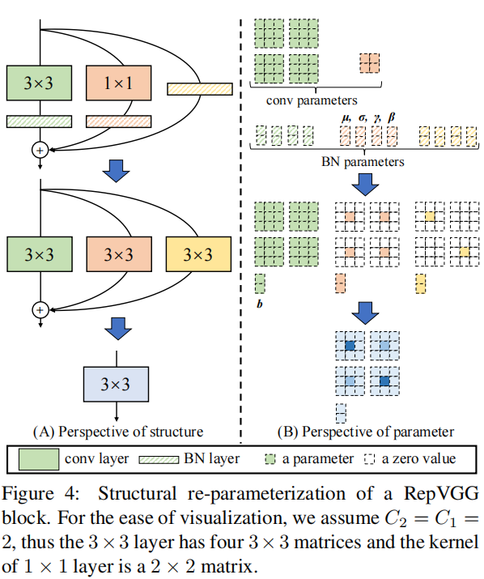

# Reparameterized-VGG
I only implemented the inference-time model for the idea of RepVGG. I wrote this code just for the beauty of some deep-learning ideas and the fun of playing Pytorch. The idea of RepVGG is presented in the following screenshot, which is taken from the original paper. Specifically, the goal is to only use 3x3 convolution kernel to represent [3x3 + 1x1 + identity], which will save computation costs. Because it puts three operations into one tensor(if we omit biases).
